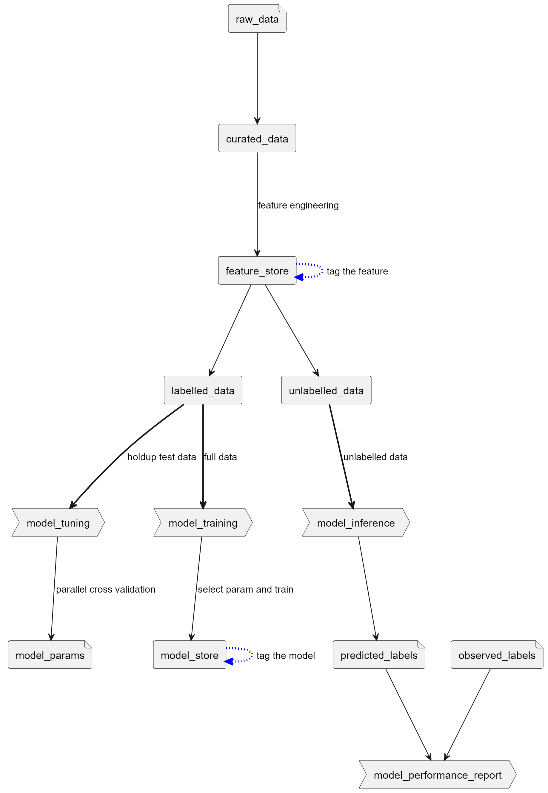
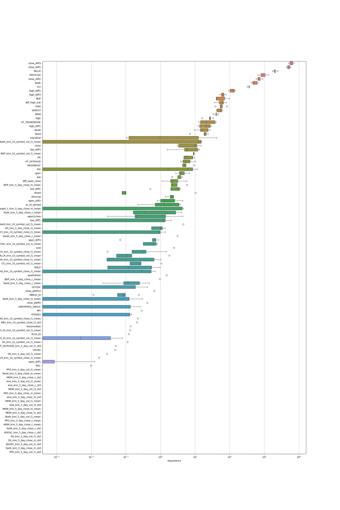

# ml-automation

## Summary
A Github based MLOps framework that strives to handle data solutions gracefully and takes care of following:

* Data privacy: strictly confine data within private cloud.
* Close source: if choose so, your source code stays within your organization.
* Flattened learning curve: Github is all you need for your data solution.
* Minimized operation cost: Maximize the utilization of existing IT resource and minimize the necessarity for new computing investiment.
* Minimalistic system design: No need for Argo/Airflow instances, neither any k8s clusters.

Apart from defining the components and workflows for productions of both machine learning modelling, inferencing workflows, this repositary also gives some examples to demonstrate how data teams can utilize Github's CI/CD automation for MLOps purposes.
Components supported:
* Data ingestion and ETL to BigQuery + Cloud Storage
* Feature engineering
* Machine learning modelling
* Parallel parameter search + cross validation
* Machine learning inference
* A/B testing
* Continuous training

Overview diagram:

## End to end automations for production

### Stock market prediction

#### Feature importaince

#### Cross Validation Evaluation per symbol

|symbol|f1                 |auc               |tpr               |fpr                 |p-total|n-total|tp |fp |tp/fp               |
|------|-------------------|------------------|------------------|--------------------|-------|-------|---|---|--------------------|
|AAPL  |0.08333333333333333|0.7386196769456681|0.6666666666666666|0.1894273127753304  |3      |227    |2  |43 |0.046511627906976744|
|ABBV  |0.10256410256410256|0.7584434654919234|0.6666666666666666|0.14977973568281938 |3      |227    |2  |34 |0.058823529411764705|
|ABT   |0.11428571428571428|0.9320175438596492|1.0               |0.13596491228070176 |2      |228    |2  |31 |0.06451612903225806 |
|ACN   |0.08333333333333333|0.6570796460176991|0.5               |0.18584070796460178 |4      |226    |2  |42 |0.047619047619047616|
|ADBE  |0.125              |0.7111111111111111|0.6               |0.17777777777777778 |5      |225    |3  |40 |0.075               |
|AIG   |0.10526315789473684|0.9254385964912281|1.0               |0.14912280701754385 |2      |228    |2  |34 |0.058823529411764705|
|AMD   |0.18181818181818182|0.9203539823008849|1.0               |0.1592920353982301  |4      |226    |4  |36 |0.1111111111111111  |
|AMGN  |0.22857142857142856|0.9402654867256638|1.0               |0.11946902654867257 |4      |226    |4  |27 |0.14814814814814814 |
|AMT   |0.14285714285714285|0.9473684210526316|1.0               |0.10526315789473684 |2      |228    |2  |24 |0.08333333333333333 |
|AMZN  |0.12               |0.7798672566371682|0.75              |0.1902654867256637  |4      |226    |3  |43 |0.06976744186046512 |
|AVGO  |0.1111111111111111 |0.9298245614035088|1.0               |0.14035087719298245 |2      |228    |2  |32 |0.0625              |
|AXP   |0.16               |0.9539473684210527|1.0               |0.09210526315789473 |2      |228    |2  |21 |0.09523809523809523 |
|BA    |0.21052631578947367|0.9336283185840708|1.0               |0.13274336283185842 |4      |226    |4  |30 |0.13333333333333333 |
|BAC   |0.25806451612903225|0.9491150442477876|1.0               |0.10176991150442478 |4      |226    |4  |23 |0.17391304347826086 |
|BK    |0.10526315789473684|0.679203539823009 |0.5               |0.1415929203539823  |4      |226    |2  |32 |0.0625              |
|BKNG  |0.14285714285714285|0.920704845814978 |1.0               |0.15859030837004406 |3      |227    |3  |36 |0.08333333333333333 |
|BLK   |0.2222222222222222 |0.9222222222222223|1.0               |0.15555555555555556 |5      |225    |5  |35 |0.14285714285714285 |
|BMY   |0.6666666666666666 |0.9933920704845816|1.0               |0.013215859030837005|3      |227    |3  |3  |1.0                 |

#### AAPL crests & troughs prediction

#### Backtest NASDAQ stocks
[Backtest NASDAQ stocks](https://docs.google.com/spreadsheets/d/1RZv5LuZ0fv8o-Xw0CaTOeEFDGK3OQd42yCVFn1bT-GY)

### Australia property listing data analysis

### Australia housing market prediction

### 